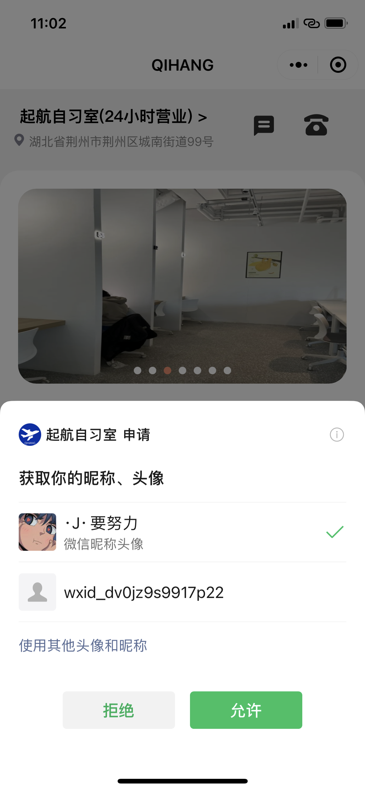
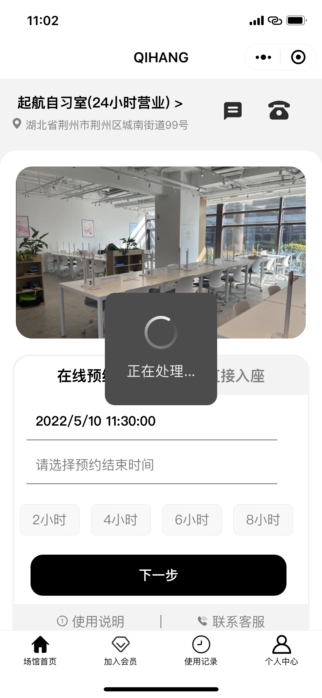
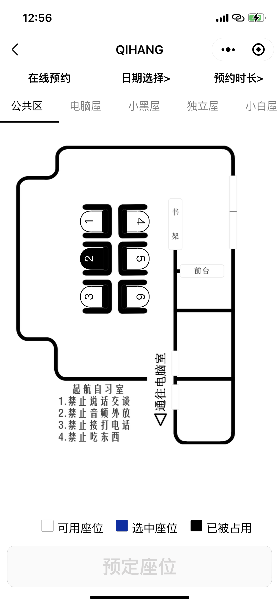
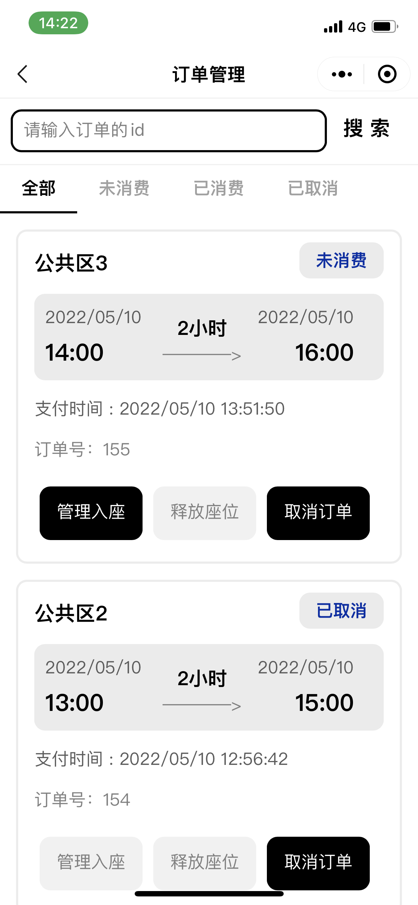

# miniprogram6

**注意：当前服务器小程序已经到期，如果  想要体验、或者有问题    请联系我的微信！！**

#### 1.介绍
自习室小程序的前端git仓库

#### 2.界面设计

##### 1.进入小程序，会弹窗提示登录！

##### 2.进入主界面

##### 3.座位预约界面

##### 4.订单管理界面

##### ......

#### 3.项目架构

wxml+wxss+javascript+java(SSM)+Tomcat8+Mysql8

#### 4.有问题联系我的vx

#### 5.项目预览

#### 6.说明

> 本项目为本科毕业设计项目，主要为了解决线下自习室运营中出现的问题，如：恶意占座、预约不方便、自习室管理员管理不方便。

> 为了方便后期修改使用，模拟数据在页面中，具体修改看下面【强调】

> 如果对您有帮助，您可以点右上角 "Star" 支持一下 谢谢！ ^_^

> 或者您可以 "follow" 一下，我会不断开源更多的有趣的项目

> 如有问题请直接在 Issues 中提，或者您发现问题并有非常好的解决方案，欢迎 PR 👍

#### 7.开发工具

IDEA2021、微信开发者工具、Navicat等

#### 8.完成功能

用户登录-----完成

预约座位（动态显示座位、查询、更新、删除、增加）------完成

订单操作（增加、删除、查询、扫码签到）----完成

套餐操作（查询）----------完成

用户操作（查询、拉黑、删除，增加）-----完成

公告管理（增加、删除）--------完成

反馈管理（增加、删除）------------完成

地址导航、签到二维码生成-------完成

#### 9.特技

1.  使用 Readme\_XXX.md 来支持不同的语言，例如 Readme\_en.md, Readme\_zh.md
2.  Gitee 官方博客 [blog.gitee.com](https://blog.gitee.com)
3.  你可以 [https://gitee.com/explore](https://gitee.com/explore) 这个地址来了解 Gitee 上的优秀开源项目
4.  [GVP](https://gitee.com/gvp) 全称是 Gitee 最有价值开源项目，是综合评定出的优秀开源项目
5.  Gitee 官方提供的使用手册 [https://gitee.com/help](https://gitee.com/help)
6.  Gitee 封面人物是一档用来展示 Gitee 会员风采的栏目 [https://gitee.com/gitee-stars/](https://gitee.com/gitee-stars/)
